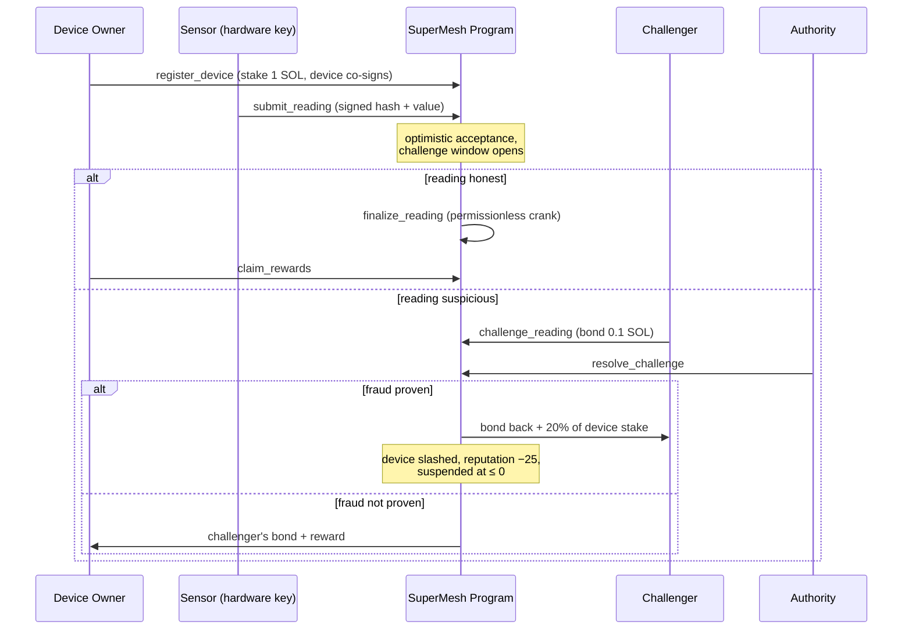

<p align="center"></p>

# SuperMesh

**A decentralized physical-infrastructure (DePIN) sensor oracle on Solana.**


## The real-world problem

Environmental data — air quality, noise, weather, radiation — is **sparse, siloed, and easy to falsify**:

- Government monitoring stations are kilometres apart; pollution varies street by street.
- Insurers, researchers and city planners pay for data they cannot independently verify.
- Centralized sensor networks have a single operator who can fabricate or censor readings.

## The solution

SuperMesh lets **anyone deploy a cheap physical sensor, stake SOL as slashable collateral, and get paid per verified reading**. Data consumers get dense, tamper-evident coverage; honest operators earn yield on hardware; liars lose their stake.

### How it works



### Crypto-economic security

| Mechanism | Purpose |
|---|---|
| **Hardware-key co-signing** | Every reading must be signed by the Ed25519 key in the device's secure element — data is attributable to a physical sensor, not just a wallet. |
| **Stake & slash (20%)** | Lying is unprofitable: expected slashing loss exceeds the reward from fabricated readings. |
| **Optimistic challenge window** | Readings cost almost nothing when honest; disputes are the expensive rare path. |
| **Challenger bonds** | Griefing honest devices costs the challenger their bond (paid to the device). |
| **Reputation score** | Repeated fraud suspends the device permanently (reputation ≤ 0). |
| **Rate limiting** | Min 20 slots between readings prevents reward-farming spam. |
| **Exit lock** | A device cannot withdraw its stake while any of its readings is under challenge. |
| **Off-chain payload, on-chain hash** | Raw measurements go to IPFS/Arweave; only a SHA-256 + scaled value lands on-chain, keeping per-reading cost tiny. |

## Program architecture

```
programs/supermesh/src/
├── lib.rs                      # program entrypoints + docs
├── constants.rs                # seeds & economic parameters
├── error.rs                    # typed errors
├── state.rs                    # Network, Treasury, Device, Reading accounts
└── instructions/
    ├── init_network.rs         # create network + treasury PDA
    ├── register_device.rs      # stake + hardware-key registration
    ├── submit_reading.rs       # optimistic reading submission
    ├── challenge_reading.rs    # bonded dispute
    ├── resolve_challenge.rs    # slash or bond forfeiture
    ├── finalize_reading.rs     # permissionless reward crank
    ├── claim_rewards.rs        # withdraw accrued rewards
    ├── deactivate_device.rs    # exit with stake (challenge-locked)
    └── set_pause.rs            # emergency circuit breaker
```

**PDA layout**

| Account | Seeds |
|---|---|
| `Network` | `["network", name]` |
| `Treasury` | `["treasury", network]` |
| `Device` | `["device", network, device_signer]` |
| `Reading` | `["reading", device, index_le_u64]` |

## Getting started

Prerequisites: Rust, Solana CLI ≥ 3.x, Anchor ≥ 1.0, Node ≥ 18.

```bash
# build the on-chain program
anchor build

# run the full LiteSVM test suite (10 lifecycle tests, no validator needed)
cargo test

# run the interactive demo against a local validator
anchor localnet          # terminal 1
npm run demo             # terminal 2 (ANCHOR_PROVIDER_URL=http://127.0.0.1:8899 ANCHOR_WALLET=~/.config/solana/id.json)
```

The demo simulates a PM2.5 air-quality sensor in Bengaluru: it registers a device, streams an honest reading, submits a bogus 999 µg/m³ reading, challenges and slashes it, then finalizes the honest reading and claims rewards.

## Web: one Next.js app (`frontend/`)

A single Next.js app serves everything — deploy the `frontend/` folder to Vercel as-is.

| Route | Page |
|---|---|
| `/` | Landing — 3D parallax scenes (SM-01 node, secure element, settlement gyro, 3D logo lattice), AI-generated photography |
| `/console` | **SuperMesh Console** — full protocol lifecycle dashboard (init → register → submit → challenge → resolve → finalize → claim) against any RPC with a burner wallet |

```bash
npm run web                # dev server (proxies to frontend/)
cd frontend && npm run build   # production build (all routes static-prerendered)
```

Deploy to Vercel: set the project root to `frontend/` — no env vars needed. Brand assets live in `frontend/public/assets/` (`logo-mark.png`, `twitter-banner.jpg` for X). Regenerate via `npm run assets` / `npm run brand` (OpenRouter key in `../.env`).

## Test coverage

`programs/supermesh/tests/test_supermesh.rs` (LiteSVM, in-process SVM):

- network init + device registration
- submit → finalize → reward accrual
- rate limiting between readings
- fraud challenge → 20% slash + challenger payout
- failed challenge → bond forfeited to device
- self-challenge rejection
- challenge-window expiry enforcement
- reward claiming
- deactivation blocked during open challenges, stake returned after
- network pause circuit breaker

## Roadmap (deep-tech upgrade path)

- **v2 — decentralized resolution:** replace authority adjudication with a staked juror committee or cross-validation against neighbouring devices (spatial consistency proofs).
- **v3 — zk attestation:** devices produce zero-knowledge proofs that readings came from certified sensor firmware (zkTLS / TEE attestations).
- **v4 — data DAO:** consumers pay per query; fees stream to devices weighted by reputation × coverage; compressed accounts (ZK-compression) for readings at scale.

## License

ISC
