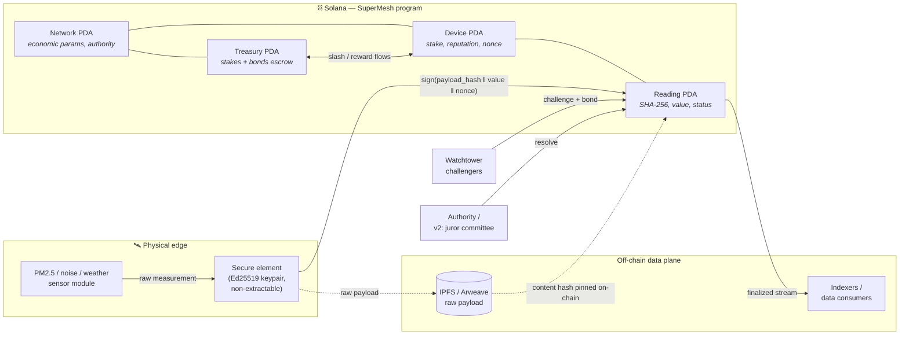
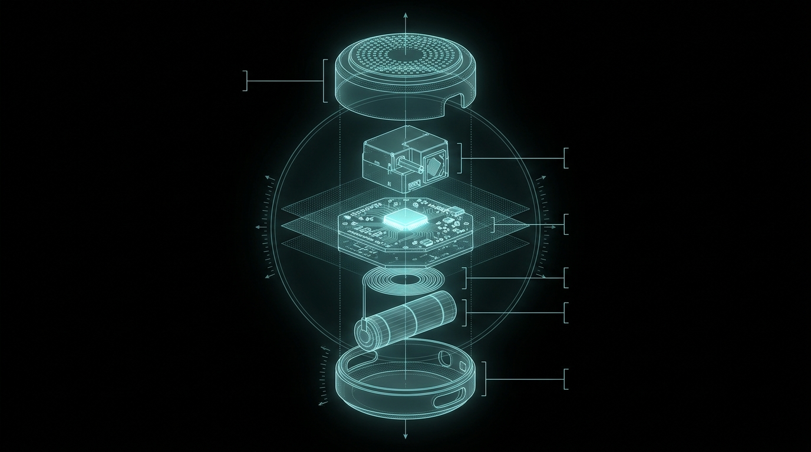
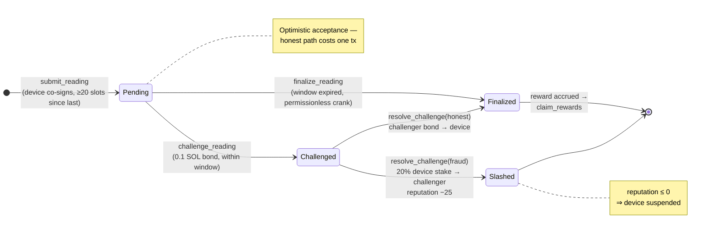
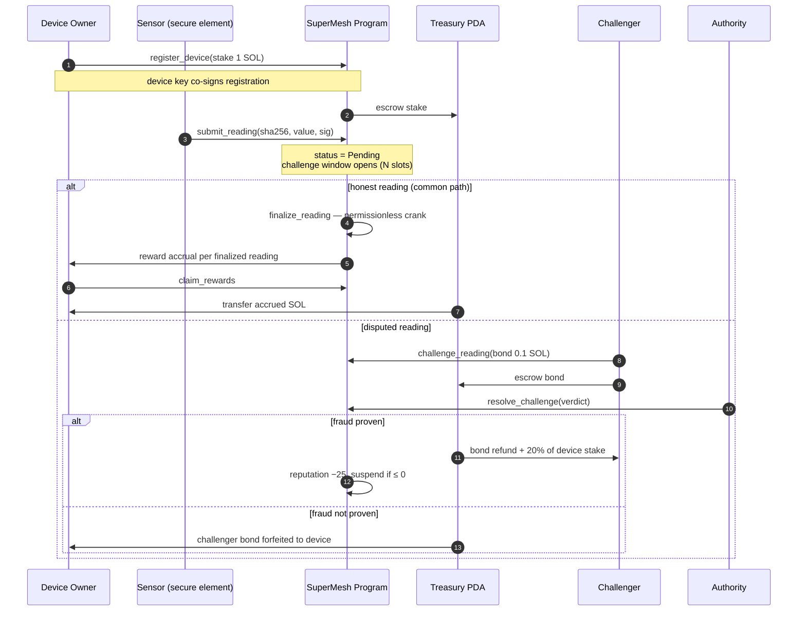
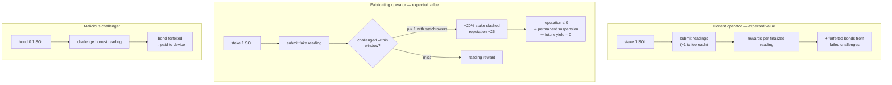
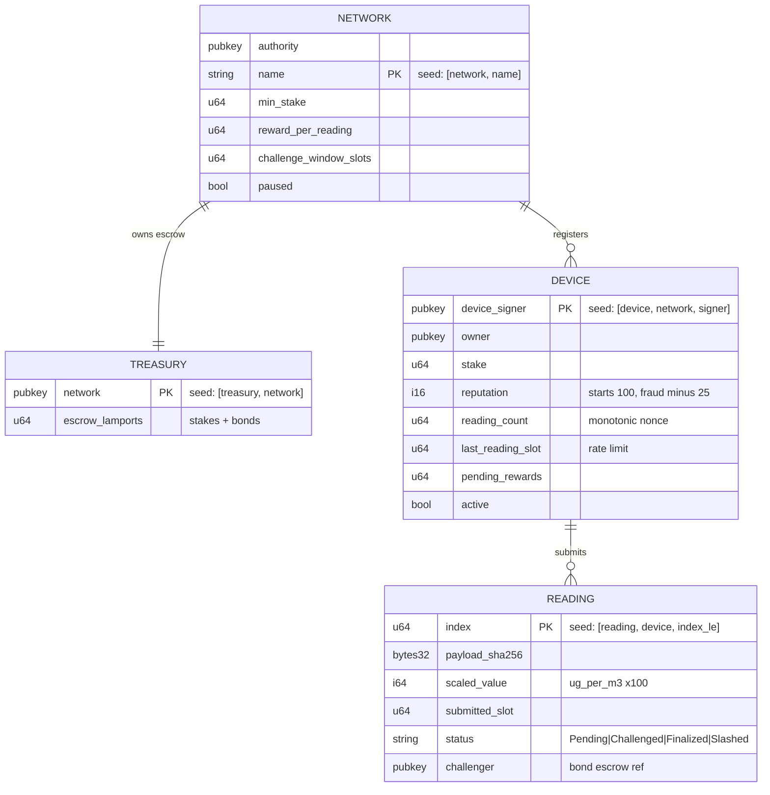
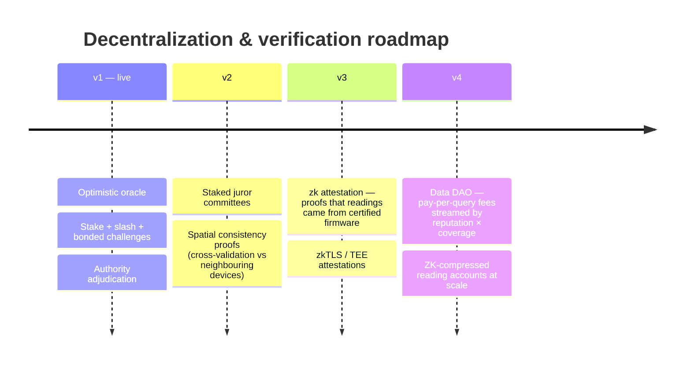

<p align="center"></p>

<h1 align="center">SuperMesh</h1>

<p align="center"><b>Verifiable physical-data infrastructure on Solana.</b><br/>
A DePIN sensor oracle where hardware-signed readings are secured by stake, slashing and optimistic dispute games.</p>

<p align="center">
  
  
  
  
</p>


---

## The real-world problem

Environmental data — air quality, noise, weather, radiation — is **sparse, siloed, and easy to falsify**:

- Government monitoring stations are kilometres apart; pollution varies street by street.
- Insurers, researchers and city planners pay for data they cannot independently verify.
- Centralized sensor networks have a single operator who can fabricate or censor readings.

## The solution

SuperMesh lets **anyone deploy a cheap physical sensor, stake SOL as slashable collateral, and get paid per verified reading**. Data consumers get dense, tamper-evident coverage; honest operators earn yield on hardware; liars lose their stake.

## System architecture



Every reading is **dual-signed**: the operator wallet pays fees while the device's secure element co-signs the payload hash — so data is attributable to a *specific physical object*, not just a wallet.

## Hardware: the SM-01 sensor node



| Layer | Component | Role in the protocol |
|---|---|---|
| 1 | Perforated housing | Passive airflow to the particulate chamber |
| 2 | PM2.5 optical sensor | Laser-scatter particle counting (µg/m³, scaled ×100 on-chain) |
| 3 | MCU + **secure element** | Ed25519 key generated in-silicon; signs every reading; key never leaves the die |
| 4 | LoRa/WiFi radio | Transports signed payloads to the RPC relay |
| 5 | Li-ion cell | ~14 months at one reading / 5 min |

The secure element's pubkey **is** the device identity: `Device` PDA = `["device", network, device_signer]`.

## Reading lifecycle — on-chain state machine



### Full protocol sequence



## Crypto-economic security model



The protocol is incentive-compatible when
`E[slash] = p_challenge × 0.20 × stake > E[fraud_reward]` — with public data and permissionless challengers, `p_challenge → 1`, so fabrication is strictly dominated.

| Mechanism | Purpose |
|---|---|
| **Hardware-key co-signing** | Readings attributable to a physical secure element, not just a wallet |
| **Stake & slash (20%)** | Expected slashing loss exceeds fabricated-reading reward |
| **Optimistic challenge window** | Honest path = 1 cheap tx; disputes are the rare expensive path |
| **Challenger bonds** | Griefing honest devices pays the *device* |
| **Reputation score** | Repeated fraud ⇒ permanent suspension at ≤ 0 |
| **Rate limiting** | ≥ 20 slots between readings blocks reward-farming spam |
| **Exit lock** | Stake locked while any reading is under challenge |
| **Off-chain payload, on-chain hash** | Raw data on IPFS/Arweave; only SHA-256 + scaled value on-chain |

## Settlement & data flow


Raw sensor payloads stream off-chain; the program settles only *commitments* — a SHA-256 hash plus a scaled integer value — keeping per-reading cost to a few thousand lamports while preserving full auditability.

## Program architecture

```
programs/supermesh/src/
├── lib.rs                      # program entrypoints + docs
├── constants.rs                # seeds & economic parameters
├── error.rs                    # typed errors
├── state.rs                    # Network, Treasury, Device, Reading accounts
└── instructions/
    ├── init_network.rs         # create network + treasury PDA
    ├── register_device.rs      # stake + hardware-key registration
    ├── submit_reading.rs       # optimistic reading submission
    ├── challenge_reading.rs    # bonded dispute
    ├── resolve_challenge.rs    # slash or bond forfeiture
    ├── finalize_reading.rs     # permissionless reward crank
    ├── claim_rewards.rs        # withdraw accrued rewards
    ├── deactivate_device.rs    # exit with stake (challenge-locked)
    └── set_pause.rs            # emergency circuit breaker
```

### Account graph & PDA derivation



## Getting started

Prerequisites: Rust, Solana CLI ≥ 3.x, Anchor ≥ 1.0, Node ≥ 18.

```bash
# build the on-chain program
anchor build

# run the full LiteSVM test suite (10 lifecycle tests, no validator needed)
cargo test

# run the interactive demo against a local validator
anchor localnet          # terminal 1
npm run demo             # terminal 2 (ANCHOR_PROVIDER_URL=http://127.0.0.1:8899 ANCHOR_WALLET=~/.config/solana/id.json)
```

The demo simulates a PM2.5 air-quality sensor in Bengaluru: it registers a device, streams an honest reading, submits a bogus 999 µg/m³ reading, challenges and slashes it, then finalizes the honest reading and claims rewards.

## Web: one Next.js app (`frontend/`)

A single Next.js app serves everything — deploy the `frontend/` folder to Vercel as-is.

| Route | Page |
|---|---|
| `/` | Landing — 3D parallax scenes (SM-01 node, secure element, settlement gyro, 3D logo lattice), AI-generated photography |
| `/console` | **SuperMesh Console** — full protocol lifecycle dashboard (init → register → submit → challenge → resolve → finalize → claim) against any RPC with a burner wallet |

```bash
npm run web                    # dev server (proxies to frontend/)
cd frontend && npm run build   # production build (all routes static-prerendered)
```

Deploy to Vercel: set the project root to `frontend/` — no env vars needed. Brand assets live in `frontend/public/assets/`; README art in `docs/img/` (regenerate via `node scripts/gen-readme.mjs`).

## Test coverage

`programs/supermesh/tests/test_supermesh.rs` (LiteSVM, in-process SVM):

- network init + device registration
- submit → finalize → reward accrual
- rate limiting between readings
- fraud challenge → 20% slash + challenger payout
- failed challenge → bond forfeited to device
- self-challenge rejection
- challenge-window expiry enforcement
- reward claiming
- deactivation blocked during open challenges, stake returned after
- network pause circuit breaker

## Roadmap (deep-tech upgrade path)



## License

ISC
